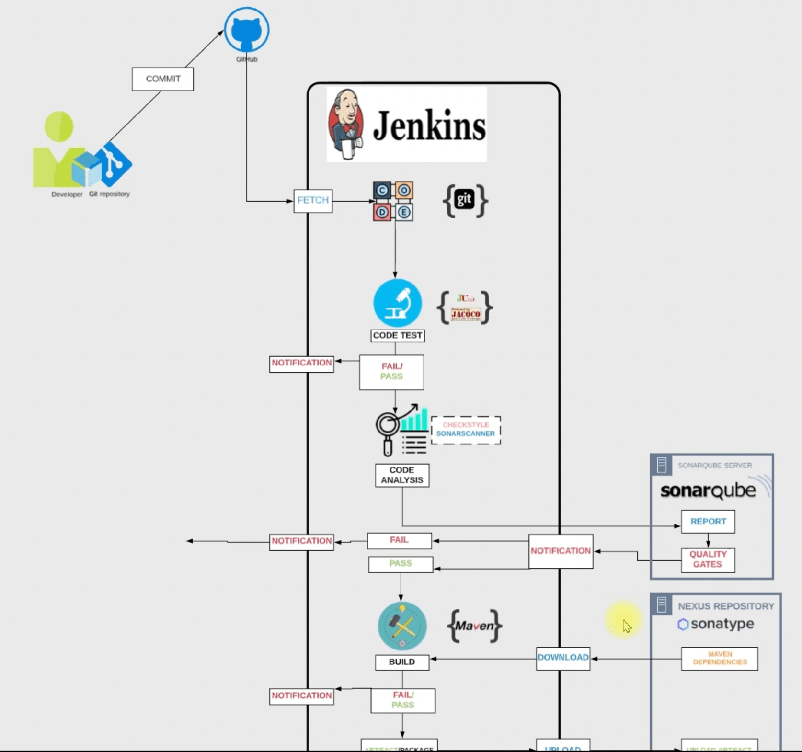

# Flow Of Execution 
1. Login to AWS account. 
2. Create login key. 
3. Create Security Groups for Jenkins, Nexus, Sonarquabe. 
4. Create Ec2 instances with userdate for Jenkins, Sonarqube, Nexus.
5. Jenkins Post installation. 
6. Nexus Repository setup. 
7. Sonarqube post installation. 
8. Jenkins Steps - Build Job, Setup Slack Notification, Checkstyle code analysis job,
   Setup Sonar integration, Sonar code analysis job, Arfifact upload job. 
9. Connect All jobs together with BuildPipeline. 
10. Set Automatic build trigger. 
11. Test with intellij. 

# Problems fixed in this projects
1. Developers needs to rework to fix bugs and error. 
2. Manual Build and Realase process. 
3. Inter Team Dependencies. 

# Benefits 
1. Fault Isolation. 
2. Agile. 
3. Short MTTR. 
4. No human intervention. 

# Tools uesd 
1. Jenkins 
2. Git and GitHub 
3. Maven
4. Checkstyle
5. Slack 
6. Nexus
7. Sonarqube
8. AWS Ec2

